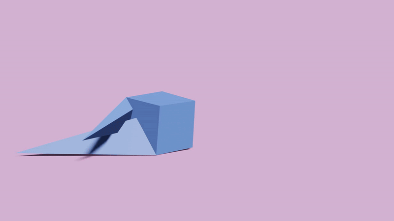
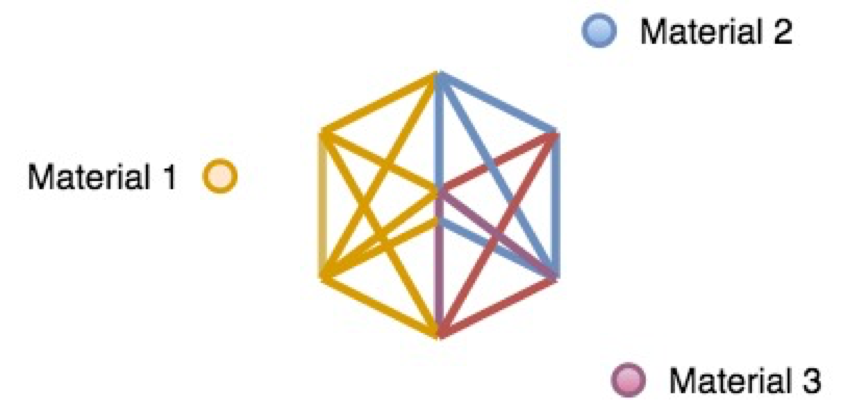
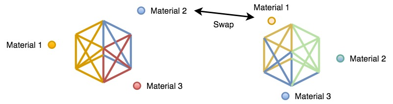
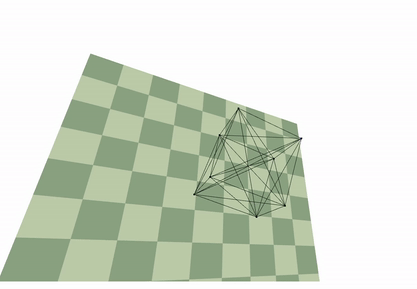

# Evolving-Robot

The work aims to *evolve*  an arbitrarily-shaped robot and the distribution of the materials on the
robot. To employ evolutionary algorithms, a physics simulator is built to intergrate with the algorithms.

## Evolutionary Computation
### Representation

### Variation Operators - Crossover

### Variation Operators - Mutation

## Physics Simulator

